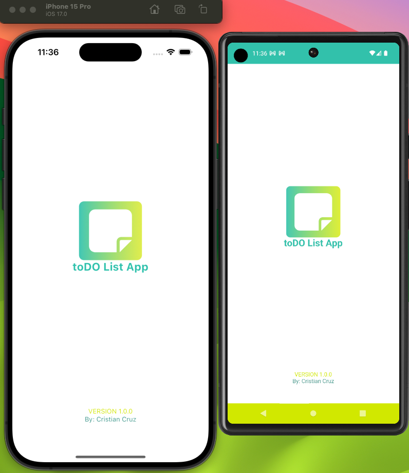
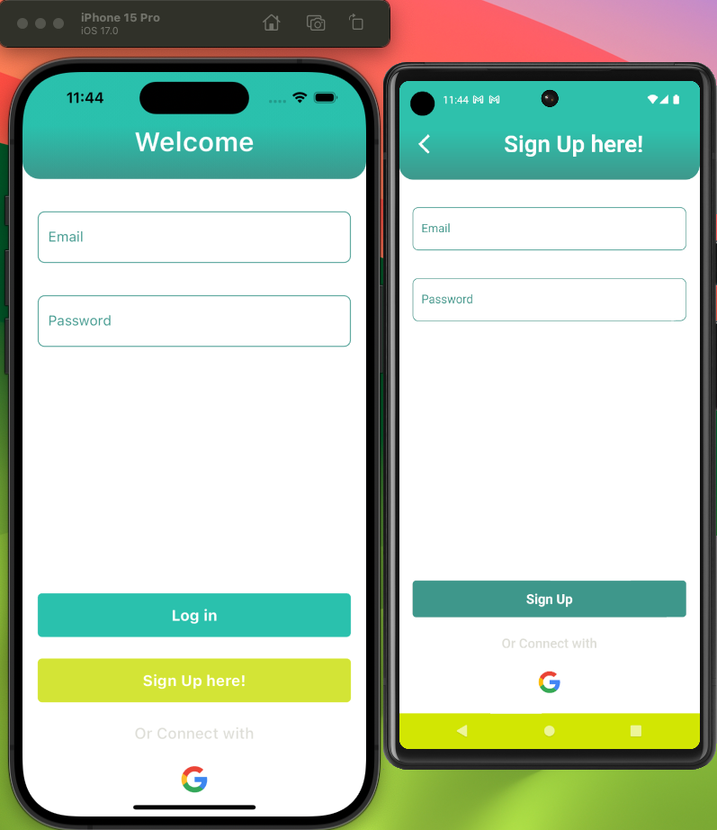
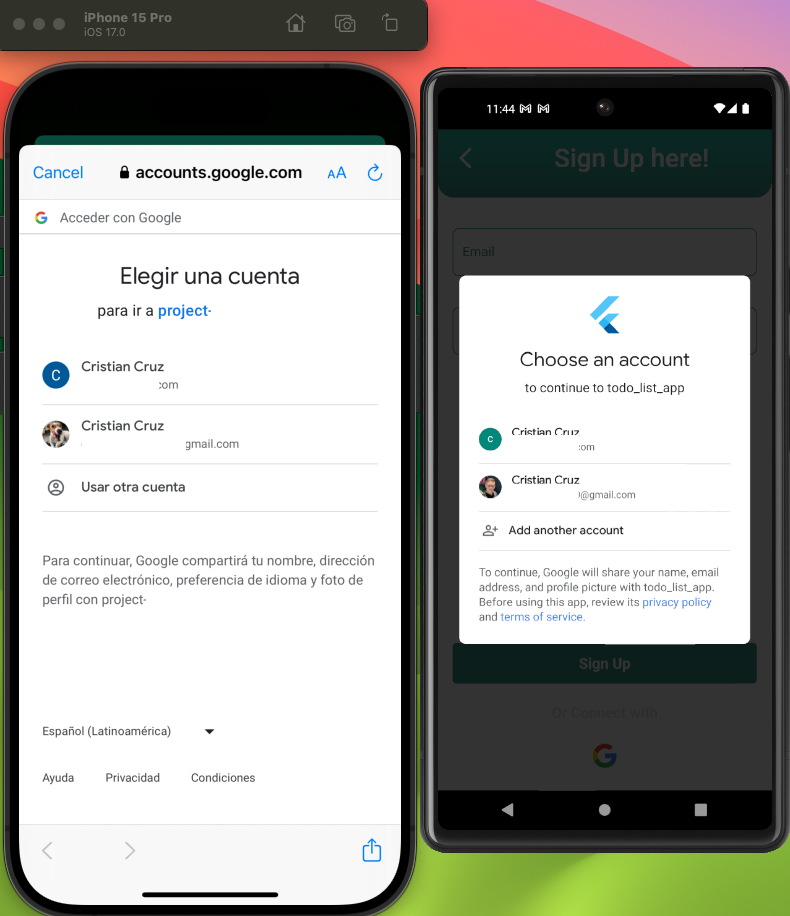
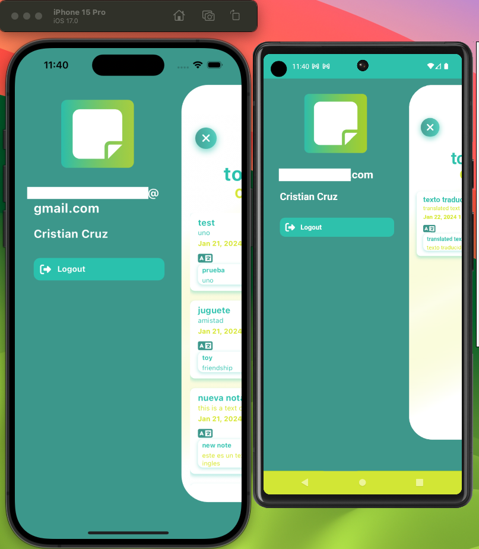
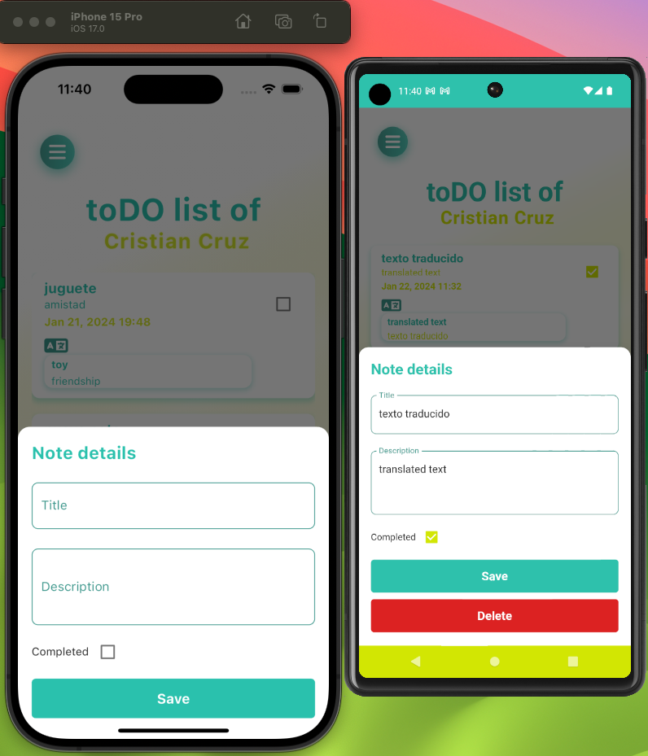
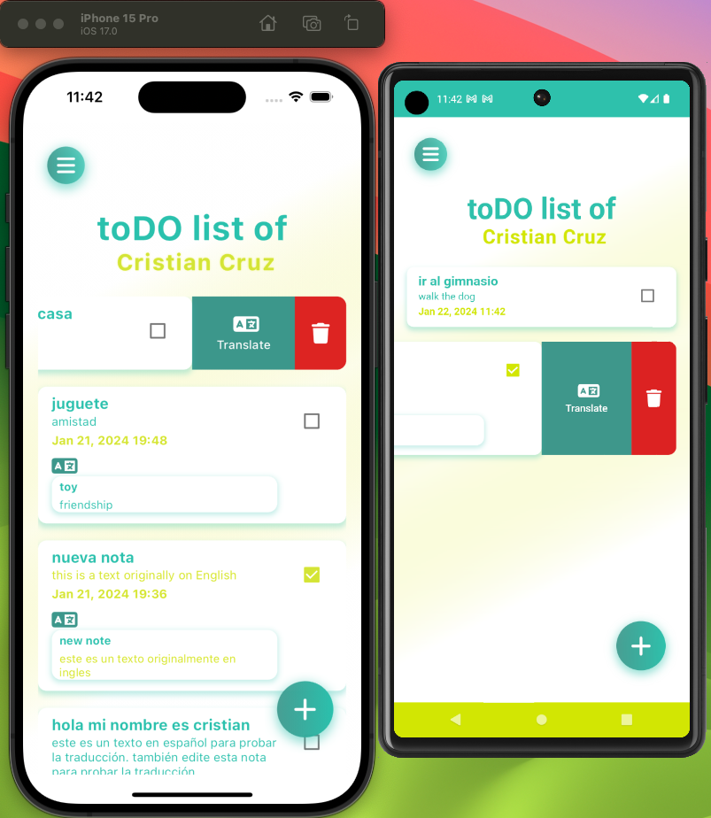
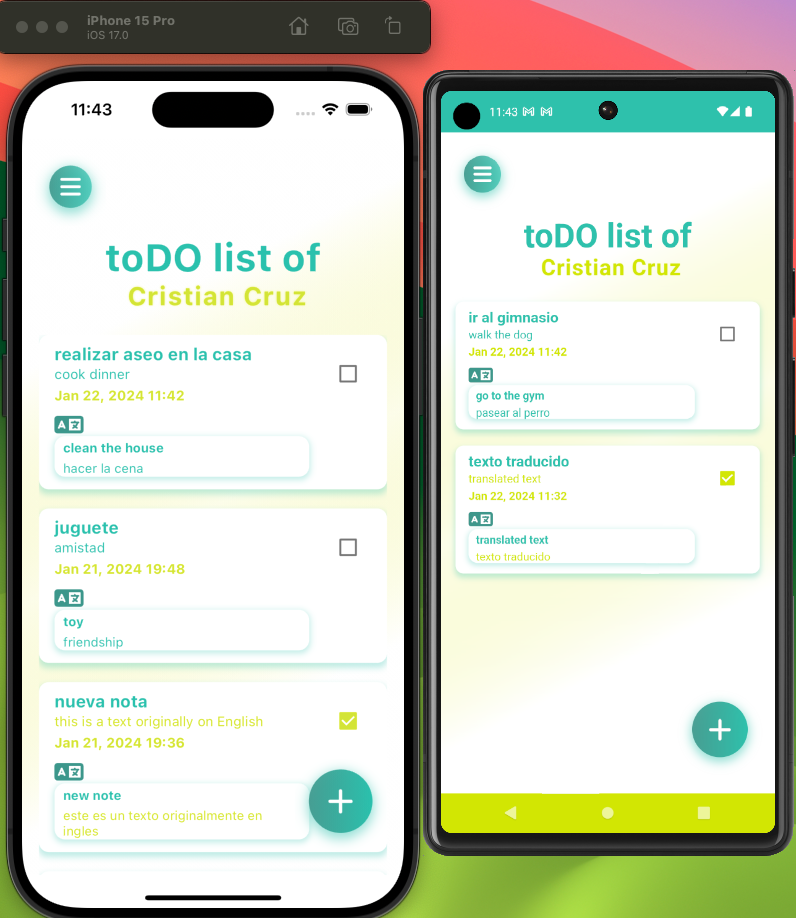

# Todo List App

A Flutter app for managing your todo list with Firebase authentication, Firestore, Firebase Functions, and Firebase Crashlytics. The app incorporates principles of Clean Architecture and follows the GetX design pattern.

## Requirements

- **Flutter SDK:** `3.29.3`
- **Dart SDK:**
- **Android Studio** or **VS Code**

## Features

### Firebase Integration

- **Authentication:**

  - Email & Password
  - Google Sign-In

- **Cloud Firestore:**

  - Store user notes and related information
  - Realtime updates for changes in the user's notes

<!-- - **Firebase Functions:**

  - Add, edit, delete, and read notes using Firebase.
  - Translate user notes in real-time using the Google Cloud Translate API on Node.js -->

### Todo List Management

- **Add, Edit, and Delete Tasks:**

  - Create new tasks, edit existing ones, and delete completed tasks
  <!--

- **Real-time Updates:**

  - See changes in your todo list in real-time as they occur -->

<!-- - **Language Translation:**

  - Translate task titles and descriptions from English to Spanish or Spanish to English using Google Cloud Translate API -->

- **Aditionals features:**
  - Snackbar notifications on app.
  - Splash Screen
  - The app's default language is based on the user's device language.

<!-- ## Screenshots

- **Splash Screen:**
  
- **Log in & a Sign up:**
  
- **Google auth:**
  
- **Drawer:**
  
- **Add note & Edit note:**
  
- **Translation feature (if the user wants to translate it):**
  
- **List of notes:**
   -->
